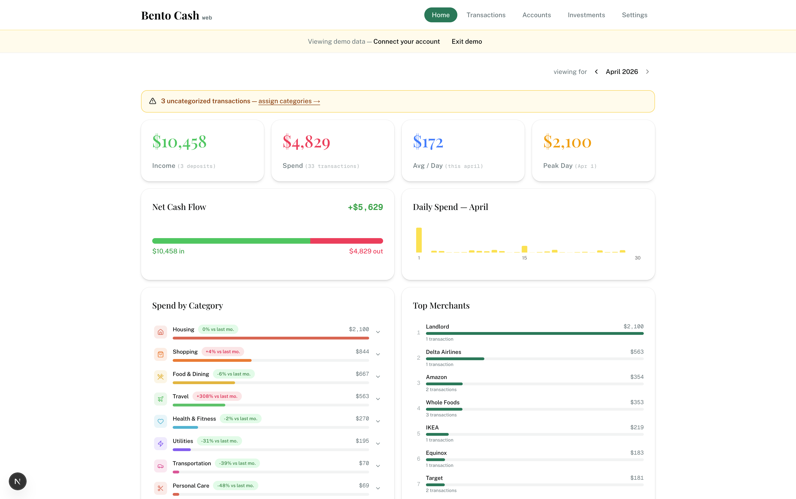
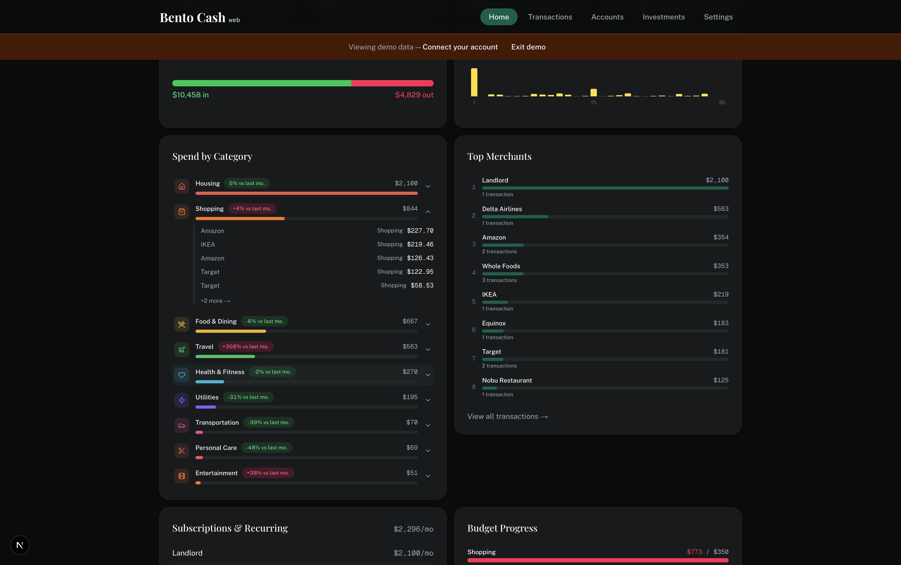
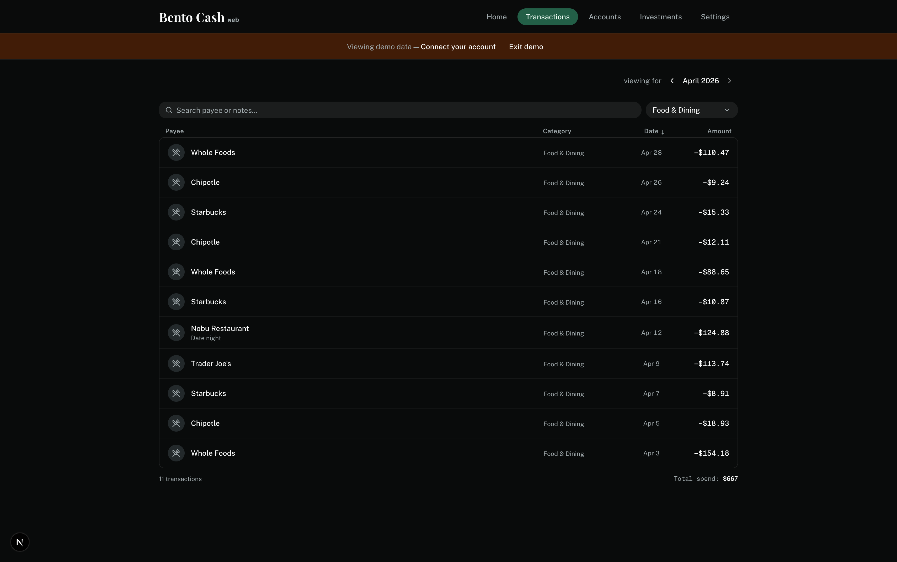
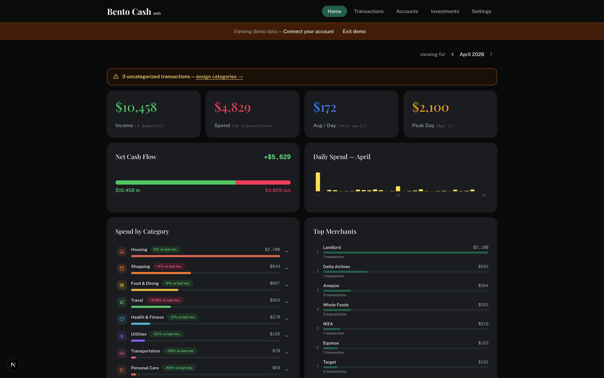

# Bento Cash

A richer analytics interface for [Lunch Money](https://lunchmoney.app) — faster daily-use, deeper spending insights, and a cleaner view of your financial picture than the native Lunch Money UI.

<picture>
  <source media="(prefers-color-scheme: dark)" srcset="screenshots/dark-mode.png">
  <source media="(prefers-color-scheme: light)" srcset="screenshots/light-mode.png">
  
</picture>

## Try the demo

No account needed — hit **Try Demo** from the home screen to explore with sample data.

## What it does

**Dashboard** — income vs. spend, daily spend chart, net cash flow, and month-over-month deltas on every category. Expand any category to see individual transactions and reassign them inline.



**Transactions** — searchable, filterable, sortable list for any month. Category edits write back to Lunch Money immediately.



**Accounts** — net worth overview with assets and liabilities grouped by institution, covering Plaid-synced and manual accounts.

**Investments** — portfolio allocation and account breakdown across all investment accounts.

**Uncategorized alerts** — amber banner whenever transactions are missing a category, with a direct link to fix them.

## Dark and light mode

Press `d` to toggle. Works across all pages.

<div align="center">
  
  
</div>

## How it works

Bento Cash is fully client-side — no backend, no server, no proxy. Your Lunch Money API token is stored in your browser's `localStorage` and API calls go directly from your browser to Lunch Money.

Nothing leaves your browser except requests to the Lunch Money API.

## Getting started

**Prerequisites:** A [Lunch Money](https://lunchmoney.app) account and an API token (Settings → Developers → Request API Access).

```bash
git clone https://github.com/your-username/bento-cash-web
cd bento-cash-web
npm install
npm run dev
```

Open [http://localhost:3000](http://localhost:3000), go to Settings, and paste your API token.

## Stack

- [Next.js 16](https://nextjs.org) (App Router, Turbopack)
- [Tailwind CSS v4](https://tailwindcss.com) + [shadcn/ui](https://ui.shadcn.com)
- [Recharts](https://recharts.org)
- [`@lunch-money/lunch-money-js-v2`](https://github.com/lunch-money/lunch-money-js)

## License

MIT
