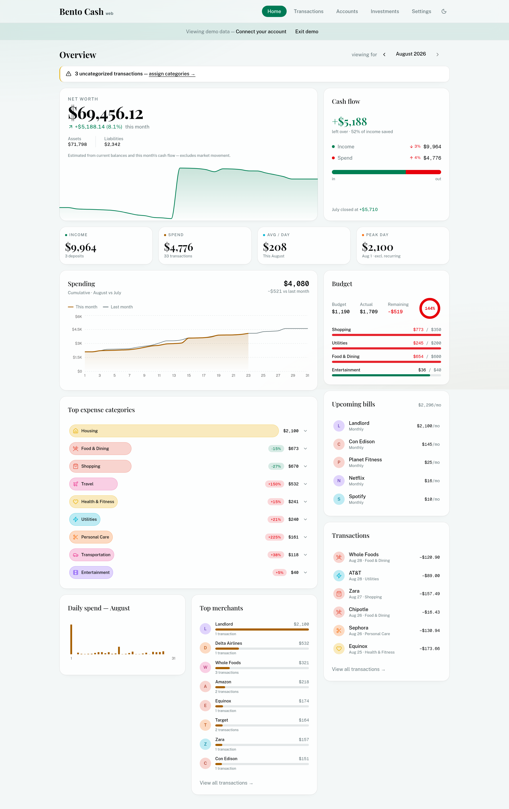
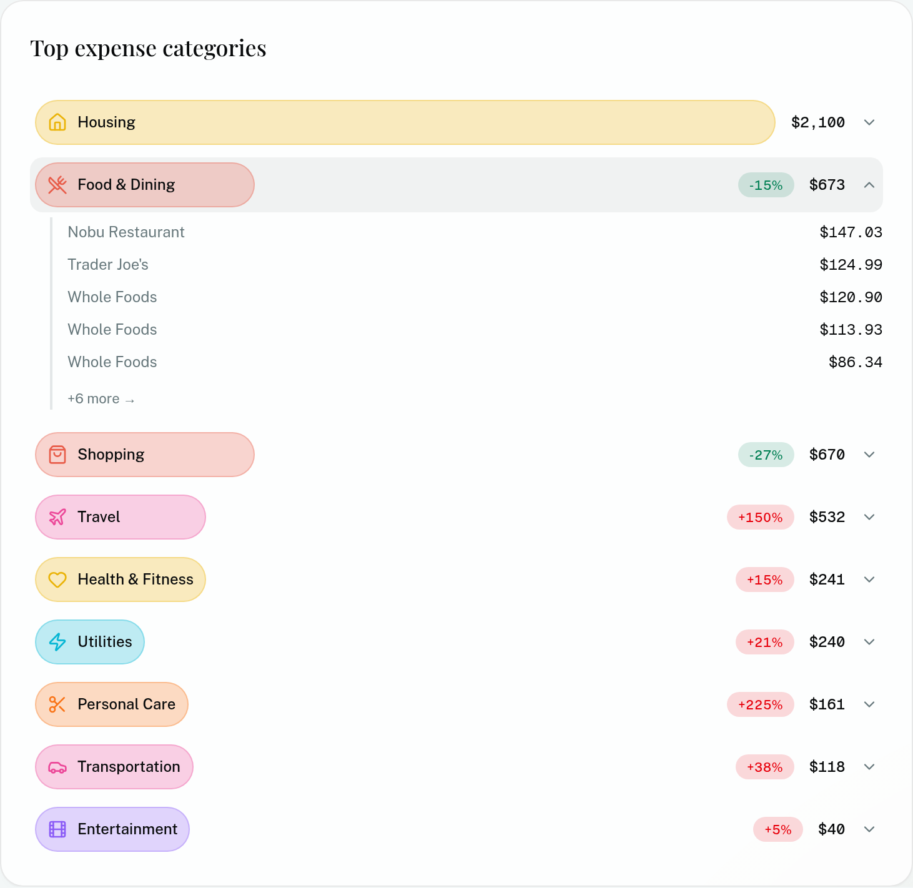
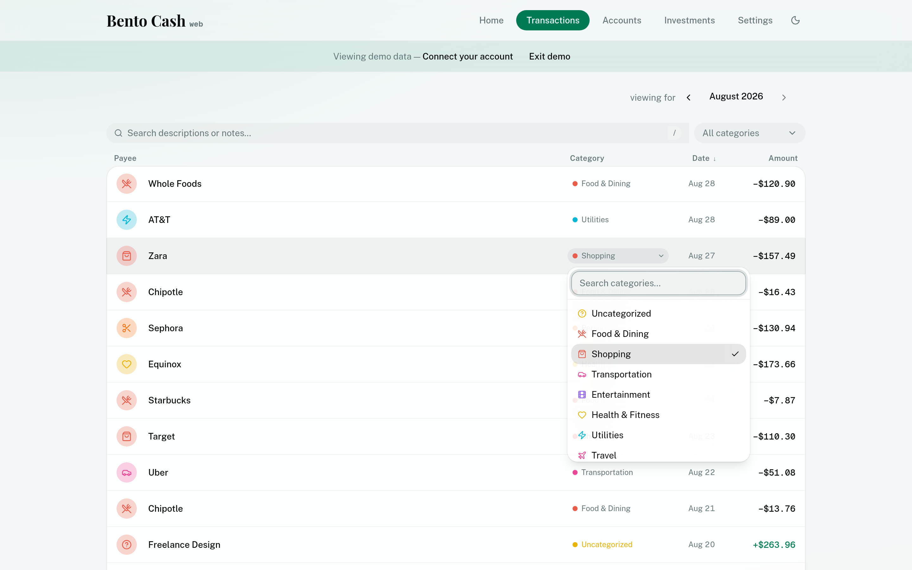
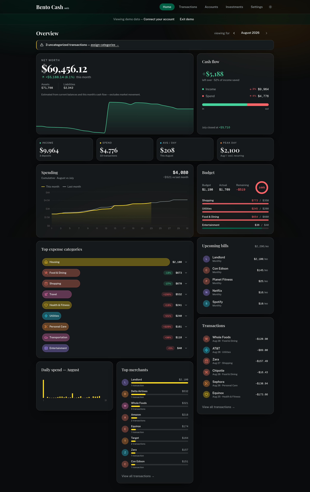

# Bento Cash

A richer analytics interface for [Lunch Money](https://lunchmoney.app) — faster daily-use, deeper spending insights, and a cleaner view of your financial picture than the native Lunch Money UI.

<picture>
  <source media="(prefers-color-scheme: dark)" srcset="screenshots/dark-mode.png">
  <source media="(prefers-color-scheme: light)" srcset="screenshots/light-mode.png">
  
</picture>

## Try the demo

No account needed — hit **Try Demo** from the home screen to explore with sample data.

## What it does

**Dashboard** — net worth, cash flow measured against last month, cumulative spending drawn against the previous month, budget progress, upcoming bills, and month-over-month deltas on every category. Expand any category to see the transactions behind it.



**Transactions** — searchable, filterable, sortable list for any month. Click a description to rename it, click a category to pick a new one from a searchable list, and expand a row for notes with explicit Save/Cancel controls. Month selection stays in the URL so dashboard drill-downs preserve context. Committed edits apply immediately and writes back to Lunch Money; a failed write rolls the row back and says so.

Keyboard: `/` focuses search, `[` and `]` step months, `Enter` takes the top match in the category picker. Under the Uncategorized filter, categorizing a row moves focus to the next one, so a queue clears without touching the mouse.



**Accounts** — net worth overview with assets and liabilities grouped by institution, covering Plaid-synced and manual accounts.

**Investments** — portfolio allocation and account breakdown across all investment accounts.

**Uncategorized alerts** — amber banner whenever transactions are missing a category, with a direct link to fix them.

## Dark and light mode

Press `d` or use the toggle in the header. Works across all pages.

<div align="center">
  
  
</div>

## How it works

Bento Cash uses Better Auth with a SQLite database for email/password accounts
and cookie sessions. Each Bento user can link multiple Lunch Money accounts and
switch between them. API keys are encrypted at rest and used only by
authenticated server routes; they are never returned to the browser after
being connected.

The data model separates the Bento user from linked Lunch Money connections, so
features and preferences can belong to a specific user/account combination and
connections can adopt OAuth later. See
[the auth architecture](docs/auth-architecture.md).

## Getting started

**Prerequisites:** Node.js 22+, pnpm, and a
[Lunch Money](https://lunchmoney.app) account with an API token (Settings →
Developers → Request API Access).

```bash
git clone https://github.com/your-username/bento-cash-web
cd bento-cash-web
pnpm install
pnpm dev
```

Copy `.env.example` to `.env.local`, set a high-entropy
`BETTER_AUTH_SECRET`, then run `pnpm dev`. Startup applies committed SQLite
migrations automatically.

Open [http://localhost:3000](http://localhost:3000), create a Bento Cash
account, and connect one or more Lunch Money API tokens.

## Stack

- [Next.js 16](https://nextjs.org) (App Router, Turbopack)
- [Tailwind CSS v4](https://tailwindcss.com) + [shadcn/ui](https://ui.shadcn.com)
- [Recharts](https://recharts.org)
- [`@lunch-money/lunch-money-js-v2`](https://github.com/lunch-money/lunch-money-js)

## License

MIT
